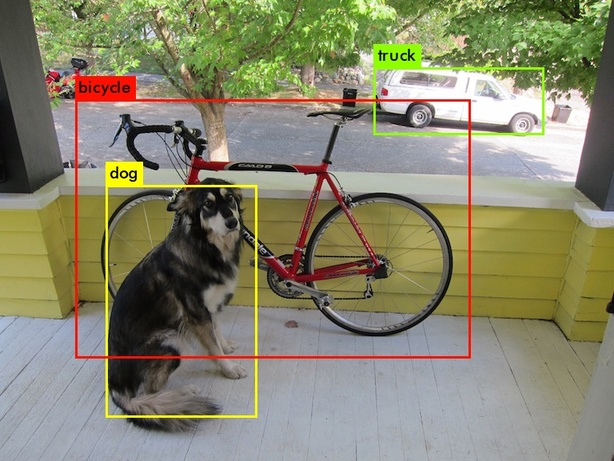
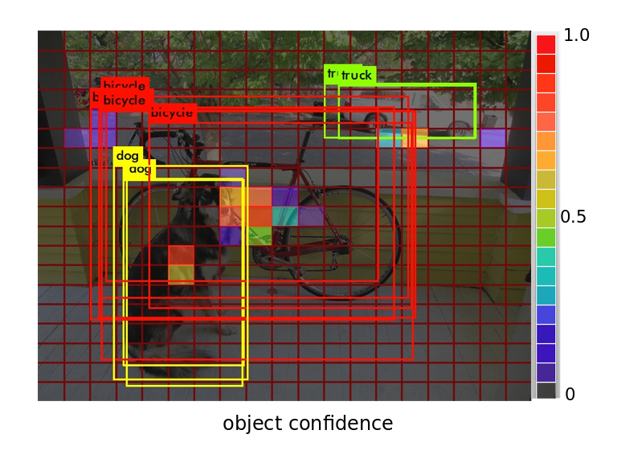
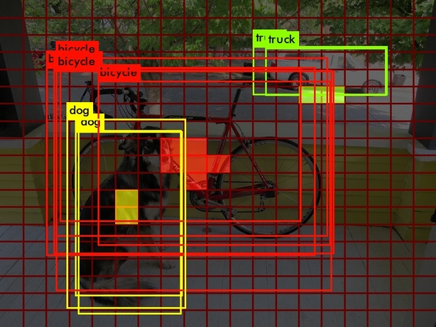
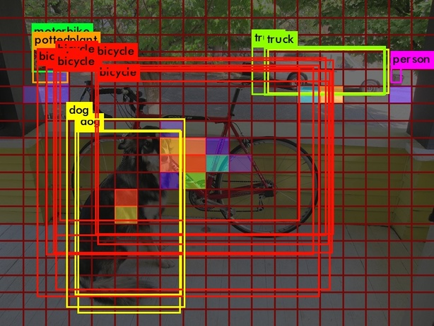

# Darknet

[Darknet](https://github.com/pjreddie/darknet) is an open source neural network framework written in C and CUDA. It is fast, easy to install, and supports CPU and GPU computation.

For more information see the [Darknet project website](http://pjreddie.com/darknet).

For questions or issues please use the [Google Group](https://groups.google.com/forum/#!forum/darknet).

## Darknet-vis

### Why does visualization matters?

Typically, if you follow the instruction on the YOLO homepage, execute

```
./darknet detector test cfg/coco.data cfg/yolo.cfg yolo.weights data/dog.jpg
```

you get the prediction results:



That looks good, however it doesn't reveal the detector's whole ability due to its fixed confidence threshold which is 0.6 by default.

If you use __darknet-vis__, besides the results image, it also generates objectness visualization and classes visualization.





Note that each grid cell corresponds to a unique position on the final feature map. In other words, it represents __receptive field__. As you can see, the YOLOv2 model also detect the trash bin at the right-top corner and the motorbike at the left-top corner with very low confidence. After decrease the threshold to 0.1, the new objectness visualization reveals more details as following



The trash bin is recognized as a person! Moreover, for small objects or some objects with special aspect ratio, the predicted center of object has a remarkable shift. All of these help you understand your YOLO model better, especially why it gets very low AP score for small objects detection.

### How to use?

Replacing Darknet with Darknet-vis is effortless, you just need to add `visualization=1` in __net__ entry of the cfg file. For example, my config in [yolo.cfg](cfg/yolo.cfg)

#### Python API

I wirte a more handy Darknet API wrapper. You can find the example at [darknet.py](https://github.com/xueeinstein/darknet-vis/blob/master/python/darknet.py). Note that `Darknet.detect_v()` is for this customized visualization.
